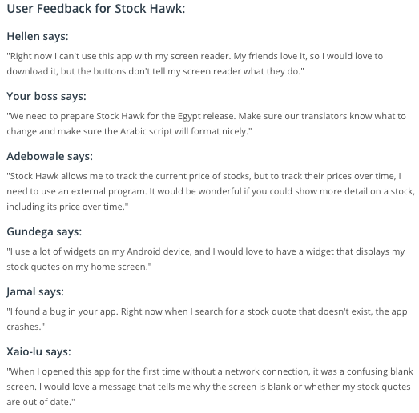

August 5, 2016  

## __Stock Hawk App__

This app is a project for the Udacity Android Developer nanodegree program. The first commit's application code was provided by Udacity, and the project's premise was to productionize the code. Some user experience reviews were provided as a baseline guide on what aspects of the current app could use adjustment. I included the baseline specs of the app provided by Udacity, and I'll update with the production stats when the app's 'production ready'.

__UX reviews__:

***

## __Baseline stats__:

__Phone UI__:

__Tablet UI__:

__Overdraw__:

__Lint__:

__Layout heirarchy__:

__Database__:

***

Clark &copy; August 2016
